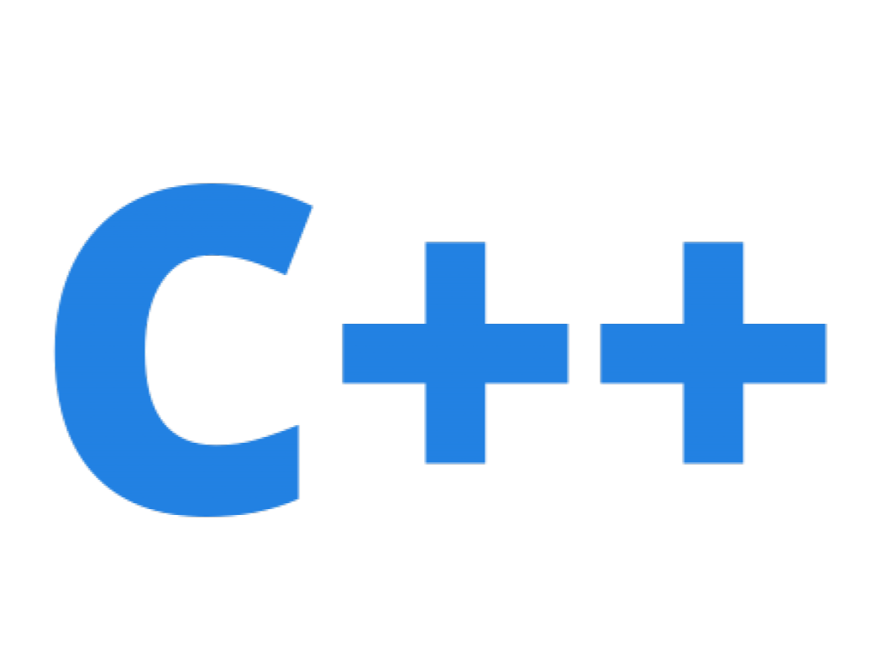

# **Theory of Algorithms**

## **Short annotation to the course:**
### The aim of the course is to form the student's knowledge about the variety of algorithms, their areas of use, methods of their software processing; formation of skills and abilities to programmatically process static and dynamic data using various methods and algorithms, including solving problems of search, sorting, processing of dynamic structures, etc.

---

## **Basic concepts of algorithm theory**

### **Lab 1.** The concept of computational complexity of algorithms, the main classes of algorithms

**📅 Date:** 03.02.2022

**📁 Project:** [link](lab_01/main.cpp)

<b>📋 Specification:</b>

The coordinates of three points of the plane are given. Check if they form a right triangle.

### **Lab 2.** Research of recursive algorithms

**📅 Date:** 19.02.2022

**📁 Project:** [link](lab_02)

<b>📋 Specification:</b>

Calculate the value of y by decomposing the function ƒ(x) into a Taylor series. Develop programs according to the algorithm using a recursive function and without using a recursive function.

|y|ƒ(x)|
|:------------:|:----:|
|(x+3) / sin(x)|sin(x)|

