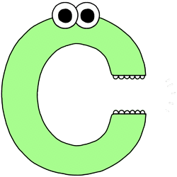

# **Theory of Algorithms**

### **Short annotation to the course:**
    
The aim of the course is to form the student's knowledge about the variety of algorithms, their areas of use, methods of their software processing; formation of skills and abilities to programmatically process static and dynamic data using various methods and algorithms, including solving problems of search, sorting, processing of dynamic structures, etc.

---

## **Basic concepts of algorithm theory**

### **Lab 1.** The concept of computational complexity of algorithms, the main classes of algorithms

**📅 Date:** 03.02.2022

**📁 Project:** [link](lab-01/main.cpp)

<b>📋 Specification:</b>

The coordinates of three points of the plane are given. Check if they form a right triangle.

### **Lab 2.** Research of recursive algorithms

**📅 Date:** 19.02.2022

**📁 Project:** [link](lab-02)

<b>📋 Specification:</b>

Calculate the value of y by decomposing the function ƒ(x) into a Taylor series. Develop programs according to the algorithm using a recursive function and without using a recursive function.

|y|ƒ(x)|
|------------|----|
|(x+3) / sin(x)|sin(x)|

### **Control 1**

**📅 Date:** 18.05.2022

**📁 Project:** [link](control-01/main.cpp)

<b>📋 Specification:</b>

Calculate the expression:

w = |cos(x) - cos(y)1 + 2sin2(y)| * (1 + z + z2 / 2 + z4 / 4

if x = 0.4 * 104, y = -0.875, z = -0.475 * 10-3, w = 1.9873)

---

## **Search algorithms**

### **Lab 3.** Research of search algorithms

**📅 Date:** 21.04.2022

**📁 Project:** [link](lab-03/main.cpp)

<b>📋 Specification:</b>

1. For these tables to implement the algorithms of the gun by these methods.

2. Determine the number of comparisons when performing different algorithms.

    Note: Input arrays of integers contain 500 elements with random numbers with values from 0 to N - 1. N = 1000.

|The purpose of the search|
|---|
|Number of elements from 0 to N - 1 in the array B. Search algorithms: linear, binary|

### **Control 2. Cycles and arrays**

**📅 Date:** 29.04.2022

**📁 Project:** [link](control-02/main.cpp)

<b>📋 Specification:</b>

1. Write a program that does the following: the user enters his year of birth and the program displays the word "Hello" as many times as he is old.
2. Write a program that generates and displays an array of 10 random numbers in the range -100 to 100, displays the index of the third negative element.

---

## **Sorting algorithms**

### **Lab 4.** Sorting algorithms

**📅 Date:** 27.04.2022

**📁 Project:** [link](lab-04/main.cpp)

<b>📋 Specification:</b>

1. Generate an array of dimension 1000 elements:
    <ol type="a">
        <li>sorted by ascending;</li>
        <li>with random elements from 0 to 1000;</li>
        <li>sorted in descending order.</li>
    </ol>

2. For the data of table to implement algorithms of sorting in ascending order,
receiving the following variables:
    <ol type="a">
        <li>number of comparisons;</li>
        <li>number of exchanges.</li>
    </ol>
3. The results of the experiment are presented in the form of a table.

|Method 1|Method 2|Method 3|
|---|---|---|
|"Bubbles" method|Sort by selection|Shell's method|

---

## **Dynamic data structures. Linear lists**

### **Practice.** Implement stack and queue based on linear list

**📅 Date:** 24.05.2022

**📁 Project:** [link](practice)

<b>📋 Specification:</b>

Create your own stack and queue and fill them with records according to the table and display.

|Type of records|Number of records|
|---|---|
|Warehouse (goods and their value)|10|

